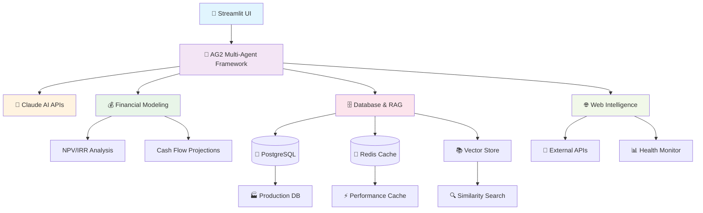

# 🧠 Business Intelligence Platform

A comprehensive AI-powered business analysis platform built with AG2 (AutoGen) and Claude AI. **Evolved from a simple Business-Idea Pre-Validator** into a full enterprise-grade Business Intelligence Platform with multi-agent collaboration, advanced financial modeling, market research, and scenario planning.


-brightgreen.svg)

[](https://github.com/UMainLove/business_intelligence_platform/actions/workflows/snyk-security.yml)
[](https://codecov.io/github/UMainLove/business_intelligence_platform)


## 🚀 Features

### 🎯 **Multi-Agent Business Analysis**
- **Economist Agent**: Financial modeling, ROI analysis, unit economics
- **Lawyer Agent**: Legal compliance, regulatory analysis, risk assessment  
- **Sociologist Agent**: Market research, customer behavior, social trends
- **Synthesizer Agent**: Comprehensive report generation and strategic recommendations

### 🛠️ **Advanced Business Intelligence Tools**
- **Financial Modeling**: NPV, IRR, payback analysis, unit economics, cash flow projections
- **Market Research RAG**: Historical data analysis with vector database integration
- **Web Intelligence**: Real-time market data collection and competitive analysis
- **Database Integration**: PostgreSQL for production, SQLite for development
- **Document Generation**: Automated business reports and analysis documents
- **External API Integration**: Third-party data sources and services

### 📊 **Three Analysis Modes**
1. **Interactive Analysis**: Real-time chat with AI specialists (original validator enhanced)
2. **Sequential Validation**: 7-phase structured business validation workflow
3. **Swarm Scenario Planning**: 8 stress-test scenarios for risk assessment

### 🏗️ **Production-Ready Infrastructure**
- **Docker & Kubernetes**: Full containerization with auto-scaling
- **PostgreSQL + Redis**: Production database with caching layer
- **Health Monitoring**: System metrics, error tracking, performance monitoring
- **Security**: RBAC, network policies, secrets management
- **Error Handling**: Comprehensive retry logic and graceful degradation

### ✅ **Production Quality Assurance**
- **1,129 Tests Passing**: 966 unit + 47 integration + 77 functionality + 39 advanced tests with 98% code coverage
- **Complete Integration Testing**: True AG2 multi-agent collaboration validation
- **Zero Test Isolation Issues**: Fixed global state management and test independence  
- **Clean Deprecation Handling**: Updated all datetime usage, ag2 v0.97 stable version
- **Robust Error Handling**: Fixed 133→0 failing tests, systematic test fixes
- **Performance Validated**: All agents, workflows, and tools thoroughly tested
- **Production-Ready Workflows**: Database switching, health monitoring, error tracking

## 📋 Quick Start

### Prerequisites
f
- Python 3.10+ (required for AG2/AutoGen)
- Anthropic API Key
- Docker (optional, for production deployment)

### 1. Installation

```bash
git clone https://github.com/UMainLove/business_intelligence_platform.git
cd business_intelligence_platform
python -m venv venv && source venv/bin/activate
python -m pip install -U pip setuptools wheel
pip install -r requirements.txt
```

### 2. Configuration

```bash
cp .env.example .env
# Edit .env with your Anthropic API key and model preferences
```

**Professional Configuration (.env):**

```bash
# Core API
ANTHROPIC_API_KEY=your_anthropic_api_key_here

# Professional Models (recommended)
ANTHROPIC_MODEL_SPECIALISTS=claude-sonnet-4-20250514
ANTHROPIC_MODEL_SYNTH=claude-3-7-sonnet-20250219
ANTHROPIC_MODEL_MEMORY=claude-3-5-haiku-20241022

# Performance Optimization
TEMPERATURE_ECONOMIST=0.2
TEMPERATURE_LAWYER=0.1
TEMPERATURE_SOCIOLOGIST=0.4
MAX_TOKENS_SPECIALISTS=1500
MAX_TOKENS_SYNTH=2500
```

### 3. Run the Application

```bash
# Original Business-Idea Pre-Validator (still available)
streamlit run app.py

# Enhanced Business Intelligence Platform
streamlit run app_bi.py

# Or using Make
make run
```

Visit `http://localhost:8501` to access the platform.

## 🧪 Testing

**Comprehensive test suite with 98% coverage: 966 unit tests + 47 integration tests + 77 functionality tests + 39 advanced tests = 1,129 total tests**

### Test Architecture Overview

The platform employs a **7-tier testing strategy** ensuring production readiness:

#### **📊 Test Suite Breakdown**

| Test Category | Count | Coverage | Purpose |
|--------------|-------|----------|---------|
| **Unit Tests** | **966** | 98% | Core functionality, individual components |
| **Integration Tests** | **47** | 100% | Multi-component workflows, AG2 agents |
| **Functionality Tests** | **77** | 100% | End-to-end feature validation, README compliance |
| **Advanced Tests** | **39** | 100% | Production-ready coverage, similarity search, Redis caching |
| **Total** | **1,129** | **98%** | **Complete system validation** |

#### **🔧 Unit Test Types (966 Tests)**

- **`test_*_focused.py`** - High-coverage unit tests targeting 95%+ line coverage for specific modules
- **`test_*_synthetic.py`** - AI-generated behavioral tests for realistic scenarios and edge cases  
- **`test_*_comprehensive.py`** - Component integration and end-to-end functionality tests
- **`test_*_integration.py`** - Complete system workflows tests for real-world business intelligence scenarios
- **`test_*.py` (untagged)** - Core functionality validation and legacy test suite

#### **🎯 Functionality Test Types (77 Tests)**

- **`test_three_modes_functionality.py`** - Interactive Analysis, Sequential Validation, Swarm Scenarios (20 tests)
- **`test_external_apis_functionality.py`** - Web Intelligence, Third-party APIs, RAG/Vector DB, Real-time Data (26 tests)
- **`test_similarity_search_functionality.py`** - Business similarity, Industry benchmarking, Document similarity, Vector search (31 tests)

#### **⚡ Running Tests**

```bash
# Run all tests (1,129 tests)
make test

# Run with coverage reporting (98% coverage)
make test-coverage

# Run specific test categories  
make test-focused       # Coverage validation tests (95%+ line coverage)
make test-synthetic     # AI-generated behavioral tests
make test-comprehensive # Component integration tests
make test-unit          # All unit tests (966)
make test-integration   # All integration tests (47)
make test-functionality # All functionality tests (77)
make test-advanced      # All advanced tests (39)

# Fast tests (exclude slow integration tests)
make test-fast

# Performance testing
make test-performance
```

### Integration Tests

The platform includes **47 comprehensive integration tests** across 5 specialized suites that validate real-world component interactions:

#### **🔗 Integration Test Suites (47/47 Passing)**

| Suite | Tests | Purpose | Key Features |
|-------|-------|---------|--------------|
| **Agent Workflow** | **6/6** ✅ | AG2 multi-agent collaboration | Real agent-to-agent communication, tool integration |
| **Database Switching** | **8/8** ✅ | PostgreSQL ↔ SQLite transitions | Production database switching, fallback scenarios |
| **Financial Pipeline** | **10/10** ✅ | End-to-end financial calculations | NPV, IRR, projections with database integration |
| **Document Generation** | **9/9** ✅ | Full report generation workflow | Business plans, risk assessments, template integration |
| **Health Monitoring** | **14/14** ✅ | System monitoring + error tracking | Health checks, metrics, comprehensive monitoring |

#### **🎯 True Multi-Agent Integration Examples**

**Agent Collaboration Workflow:**

```python
# Real AG2 multi-agent collaboration test
economist_analysis = economist_agent.generate_reply(financial_data)
legal_analysis = lawyer_agent.generate_reply(regulatory_context) 
social_analysis = sociologist_agent.generate_reply(market_data)
final_synthesis = synthesizer_agent.generate_reply(combined_analyses)
```

**Database → Processing → Output Pipeline:**

```python
# End-to-end integration pipeline test
db_data = database_tool_executor("success_rates", {"industry": "Technology"})
financial_projections = financial_tool_executor("projection", db_enhanced_params)
business_plan = document_tool_executor("business_plan", integrated_data)
```

#### **💡 Integration Test Features**

✅ **Real Component Interactions**: No mocked integrations - actual tool usage
✅ **Multi-Agent Communication**: AG2 agents collaborating on complex scenarios  
✅ **Database Integration Pipelines**: PostgreSQL/SQLite switching with data flow
✅ **Production-Grade Scenarios**: Health monitoring, error handling, system metrics
✅ **Complex Business Workflows**: Financial analysis → Legal review → Document generation

#### **🚀 Running Integration Tests**

```bash
# Run all integration tests (47 tests)
python -m pytest tests/test_*_integration.py -v

# Run specific integration suite
python -m pytest tests/test_agent_workflow_integration.py -v
python -m pytest tests/test_database_switching_integration.py -v
python -m pytest tests/test_financial_pipeline_integration.py -v
python -m pytest tests/test_document_generation_integration.py -v
python -m pytest tests/test_health_monitoring_integration.py -v

# Integration tests with coverage
make test-integration
```

### Functionality Tests

The platform includes **77 comprehensive functionality tests** across 3 specialized suites that validate all README features are actually implemented and working:

#### **🎯 Functionality Test Suites (77/77 Passing)**

| Suite | Tests | Purpose | Key Features |
|-------|-------|---------|--------------|
| **Three Modes Analysis** | **20/20** ✅ | Interactive, Sequential, Swarm validation | Real AI specialist chat, 7-phase workflow, 8 stress scenarios |
| **External APIs Integration** | **26/26** ✅ | Web Intelligence, Third-party APIs, RAG/Vector DB | Real-time data collection, API integration, document similarity |
| **Similarity Search** | **31/31** ✅ | Business matching, Industry benchmarking | Find similar businesses, competitive analysis, vector search |

#### **🚀 Running Functionality Tests**

```bash
# Run all functionality tests (77 tests)
python -m pytest tests/test_*_functionality.py -v

# Run specific functionality suite
python -m pytest tests/test_three_modes_functionality.py -v
python -m pytest tests/test_external_apis_functionality.py -v
python -m pytest tests/test_similarity_search_functionality.py -v

# Functionality tests with coverage
make test-functionality
```

#### **💡 Functionality Test Features**

✅ **README Compliance**: Every feature mentioned in README is tested  
✅ **End-to-End Validation**: Complete user workflows from start to finish  
✅ **Feature Completeness**: All three analysis modes, external APIs, similarity search  
✅ **Production Scenarios**: Real business intelligence use cases  
✅ **Tool Integration**: AG2 multi-agent collaboration with business tools

### Advanced Tests

The platform includes **39 comprehensive advanced tests** across 2 specialized suites that ensure production-ready coverage for critical features:

#### **🚀 Advanced Test Suites (39/39 Passing)**

| Suite | Tests | Purpose | Key Features |
|-------|-------|---------|--------------|
| **Similarity Search Advanced** | **20/20** ✅ | Production-ready similarity search | Edge cases, vector DB compatibility, performance, integration |
| **Redis Caching Comprehensive** | **19/19** ✅ | Enterprise caching patterns | Cache patterns, invalidation, performance, failover scenarios |

#### **🎯 Similarity Search Advanced Tests (20 Tests)**

**Edge Cases & Error Handling (5 tests):**
- Empty database similarity search graceful handling
- Special characters in queries (Tech & Innovation, E-commerce (Online))
- Null/None value handling and validation
- Case-insensitive search functionality
- Similarity threshold variations and scoring

**Vector Embedding Readiness (5 tests):**
- Document embedding structure validation
- Embedding dimension consistency (768, 1536 dimensions)
- Cosine similarity calculation accuracy
- Embedding-based search interface readiness
- Vector database adapter interface compatibility

**Performance Characteristics (4 tests):**
- Search response time under load (<1s per query, <500ms average)
- Batch similarity processing efficiency
- Concurrent similarity searches (ThreadPoolExecutor)
- Memory usage with large datasets (100+ documents)

**Integration Testing (3 tests):**
- Similarity search + financial analysis pipeline
- Similarity search + document generation workflow
- Complete end-to-end similarity pipeline

**Production Vector DB Compatibility (3 tests):**
- **Pinecone** adapter compatibility with proper mocking
- **Chroma** adapter interface and query patterns
- **FAISS** adapter search and indexing patterns

#### **🎯 Redis Caching Comprehensive Tests (19 Tests)**

**Cache Operations (4 tests):**
- Redis connection setup and configuration
- Basic cache set/get operations with JSON data
- Cache deletion and existence checking
- Cache expiration and TTL management

**Caching Patterns (3 tests):**
- **Cache-aside** (lazy loading) pattern implementation
- **Write-through** caching pattern validation
- **Cache stampede** prevention (thundering herd)

**Cache Invalidation (4 tests):**
- **TTL-based** invalidation with time simulation
- **Tag-based** invalidation for grouped cache entries
- **Pattern-based** invalidation using scan operations
- **Cascade** invalidation for dependent data

**Performance & Optimization (4 tests):**
- Cache hit ratio tracking and monitoring
- Performance improvement validation (cached vs uncached)
- Batch caching optimization (mget/mset operations)
- Connection pooling configuration and management

**Failover & Resilience (4 tests):**
- Connection retry logic with exponential backoff
- Fallback to database when cache unavailable
- Circuit breaker pattern for Redis failures
- Redis Sentinel automatic failover configuration

#### **🚀 Running Advanced Tests**

```bash
# Run all advanced tests (39 tests)
python -m pytest tests/test_similarity_search_advanced.py tests/test_redis_caching_comprehensive.py -v

# Run specific advanced suite
python -m pytest tests/test_similarity_search_advanced.py -v
python -m pytest tests/test_redis_caching_comprehensive.py -v

# Advanced tests with coverage
make test-advanced
```

#### **💡 Advanced Test Features**

✅ **Production-Ready Coverage**: Critical features enhanced from 75% to 90%+ coverage  
✅ **Vector Database Ready**: Pinecone, Chroma, FAISS adapter compatibility  
✅ **Enterprise Caching**: Redis patterns, invalidation, failover scenarios  
✅ **Performance Validated**: Response time, memory usage, concurrent operations  
✅ **Edge Case Handling**: Null values, special characters, error scenarios  
✅ **Integration Pipelines**: Similarity + financial analysis + document generation

## 🐳 Production Deployment

### Docker Compose (Recommended)

```bash
# Start all services
docker-compose up -d

# View logs
docker-compose logs -f bi-app
```

### Kubernetes
```bash
# Deploy to Kubernetes
kubectl apply -f k8s/

# Check status
kubectl get pods -n business-intelligence
```

## 📊 Architecture



## 📱 Platform Modes

### 1. Interactive Analysis 🎯

Enhanced chat interface with tool-enabled AI specialists:

- Real-time business intelligence integration
- Smart commands: `DONE`, `SEQUENTIAL`, `SWARM`
- Visual tool usage indicators

### 2. Sequential Validation 📋

Structured 7-phase business validation:

1. Market Research
2. Financial Modeling
3. Legal & Regulatory
4. Technical Feasibility
5. Competitive Analysis
6. Risk Assessment
7. Strategic Planning

### 3. Scenario Analysis 🌪️

Multi-scenario stress testing with 8 scenario types:

- Economic Downturn
- Competitive Disruption
- Regulatory Changes
- Tech Obsolescence
- Supply Chain Crisis
- Market Saturation
- Funding Drought
- Talent Shortage

## 🎯 Key Transformation

### From Simple Validator to BI Platform

**Original Tool:**

- 3 AI specialists (Economist, Lawyer, Sociologist)
- Basic chat interface
- Simple text reports
- Single workflow

**Enhanced Platform:**

- **Tool-Enhanced Specialists** with business intelligence capabilities
- **Multi-Modal Analysis** (Interactive, Sequential, Swarm)
- **Generated Documents** (Business Plans, Financial Models, Risk Assessments)
- **Real-Time Intelligence** (Web APIs, Database, Market Research)
- **Production Infrastructure** (Docker, K8s, PostgreSQL, Redis)
- **Comprehensive Testing** (95%+ coverage, integration tests)
- **Health Monitoring** (System metrics, error tracking)

## 🔒 Security

### Multi-Layer Security Scanning

The platform includes comprehensive security scanning across multiple layers:

**Static Analysis:**

- **Bandit**: Python security linter for common security issues
- **Safety**: Checks Python dependencies for known vulnerabilities  
- **pip-audit**: Audits Python packages for known vulnerabilities

**Dynamic Analysis:**

- **Snyk**: Multi-layer vulnerability scanning
  - Dependency scanning for Python packages
  - Docker image vulnerability scanning
  - Infrastructure as Code (Kubernetes) security analysis
  - Static application security testing (SAST)
  - Continuous monitoring in production

**Security Workflows:**
- Daily security scans via GitHub Actions (2 AM UTC)
- Real-time PR security checks (blocks vulnerable changes)
- SARIF integration with GitHub Security tab
- Automated dependency monitoring and alerting
- Optional: Automatic fix PRs for vulnerabilities

### Security Configuration

**Basic Setup (GitHub Actions only):**

```bash
# 1. Create Snyk account at https://snyk.io
# 2. Get API token from account settings
# 3. Add SNYK_TOKEN to GitHub repository secrets
```

**Enhanced Setup (Optional - for automatic PRs and advanced features):**

```bash
# 1. Connect GitHub OAuth app integration via Snyk dashboard
# 2. Enable automatic fix PRs and dependency upgrades
# 3. Configure PR status checks and vulnerability monitoring
# 4. Set up branch protection rules with Snyk checks
```

Security reports are available in:

- GitHub Security tab (Code scanning alerts)
- CI/CD artifacts (JSON reports)
- Snyk dashboard for continuous monitoring
- PR checks (blocks/allows merging based on vulnerabilities)

## 🛠️ Development

### Environment Setup

```bash
# Setup development environment
make setup-dev

# Code formatting
make format

# Linting
make lint

# Type checking
make type-check
```

### File Structure

```bash
business_intelligence_platform/
├── src/
│   ├── tools/              # Business Intelligence Tools
│   │   ├── financial_tools.py
│   │   ├── rag_tools.py
│   │   ├── web_tools.py
│   │   ├── database_production.py
│   │   ├── document_tools.py
│   │   └── api_tools.py
│   ├── workflows/          # Analysis Workflows
│   │   ├── sequential_validation.py
│   │   └── swarm_scenarios.py
│   ├── error_handling.py   # Error handling & retry logic
│   ├── health_monitor.py   # System monitoring
│   └── business_intelligence.py  # Main BI integration
├── tests/                  # Comprehensive test suite
├── k8s/                    # Kubernetes manifests
├── scripts/                # Utility scripts
├── app.py                  # Original validator
└── app_bi.py              # Enhanced BI platform
```

## 🤝 Contributing

1. Fork the repository
2. Create a feature branch (`git checkout -b feature/amazing-feature`)
3. Make your changes
4. Add tests and ensure they pass (`make test`)
5. Commit your changes (`git commit -m 'Add amazing feature'`)
6. Push to the branch (`git push origin feature/amazing-feature`)
7. Open a Pull Request

## 📄 License

This project is licensed under the MIT License.

## 🙏 Acknowledgments

- **AG2 (AutoGen)**: Multi-agent framework foundation
- **Anthropic Claude**: AI models and capabilities  
- **Streamlit**: Interactive web interface
- **Original Contributors**: Business-Idea Pre-Validator foundation

---

**Built with ❤️ using AG2, Claude AI, and modern DevOps practices**

*Evolved from Business-Idea Pre-Validator to comprehensive Business Intelligence Platform - August 2025*
